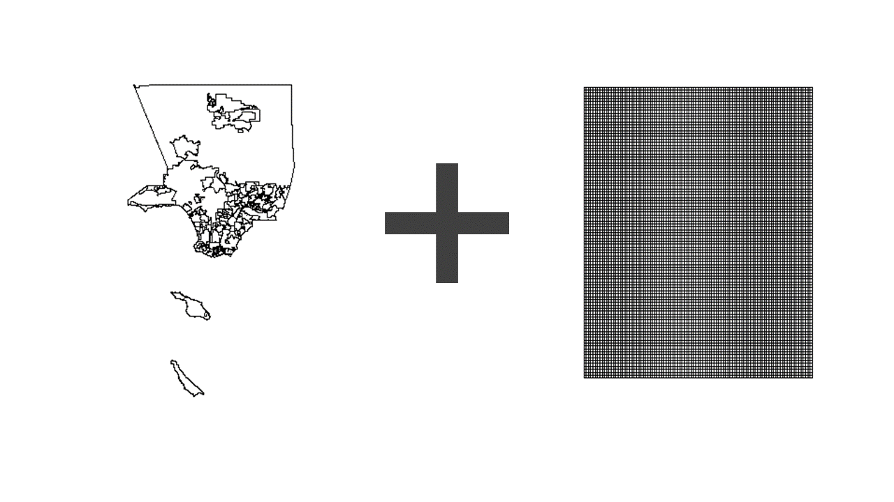
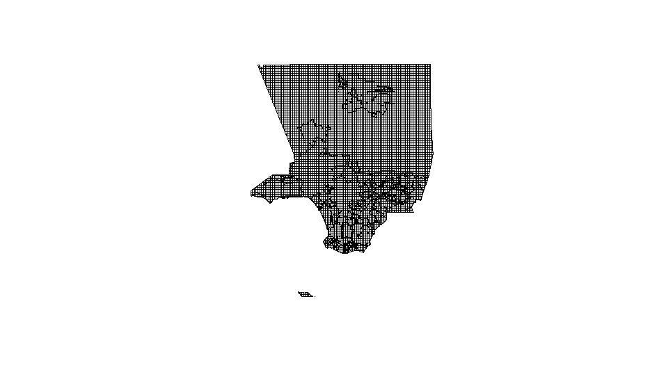
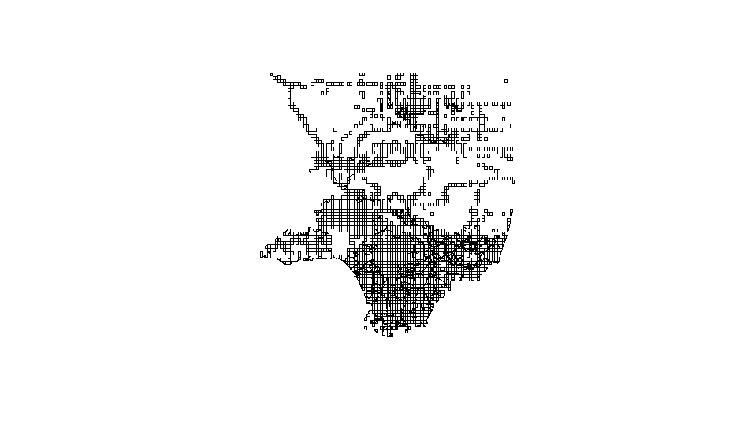
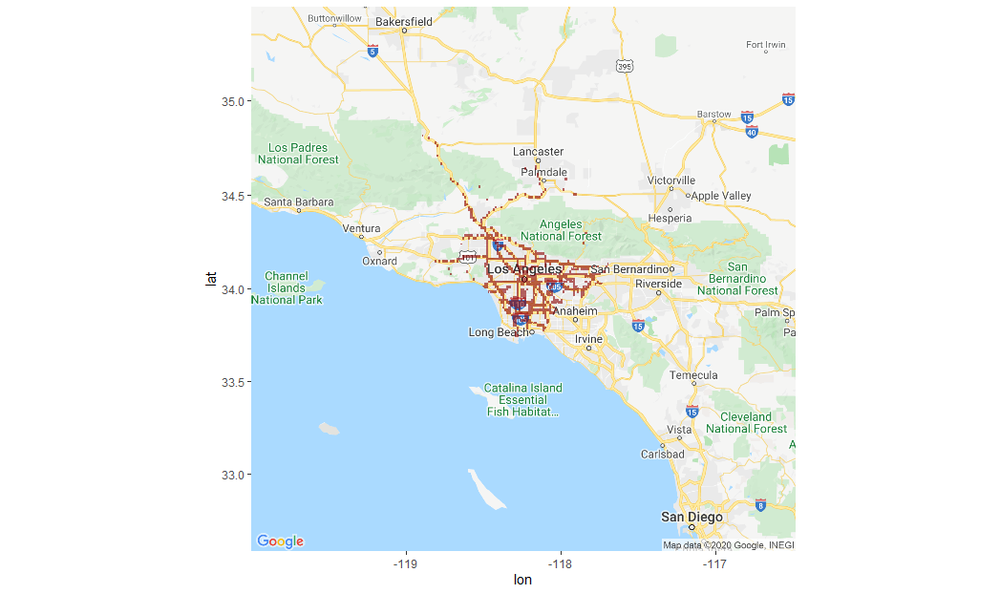
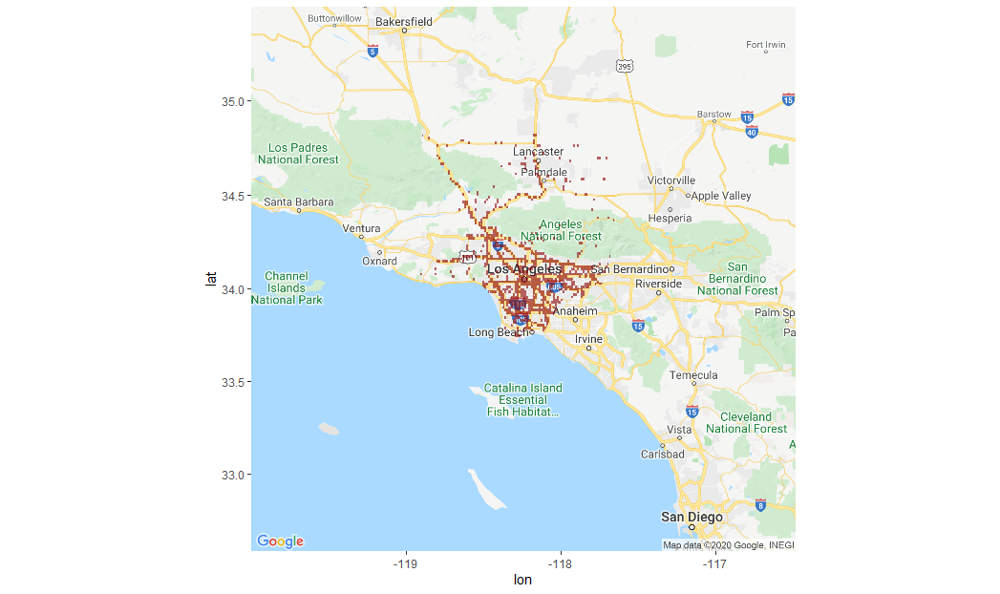

# Grid based Accident Prediction using DNN


A road traffic accident is one of the serious problems related to normal daily life. The frequency of accidents is more in certain areas as compared with other areas due to various landmarks around it or the location of the area. The field of computer science has improved a lot in the recent area and it has opened various paths for solving the various problems in different fields. The grid-based approach for prediction of locational data has proven to be a successful algorithm so we will focus on the integration of grid-based models with Deep Neural Network. Also, the previous frequency of incidence can predict the accident rate in an area that can classify the area as accidental prone area so we will also use the number of incidences in the previous time for training the model corresponding to each area.

## Pre-requirement 

The web framework used
* [R](https://www.r-project.org/) - Used to create DNN model
* [Google Maps Static Api ](https://developers.google.com/maps/documentation) - Used for final plotting of predicted hotspots


## Step to run
1. Pull the code and Setup R studio
2. Change Path for files in code (one for Data file and other for using Map shapefile file)
3. Download the libraries that are not installed in R Like ggmap, h2o, and any other library that is required.
4. Activate the Google Map Api from google console and run this command in Console
```R
register_google(key = "[your key]", write = TRUE)
```
5. Run the Code and Loading of Maps will take some time.

## Los Angeles MAP


## Intersection of Grid and LA MAP


## Remove the points with no accidents in the entire data


## Predicted Hotspot


## Real Hotspot


